# Knowledge Graph Publisher for Obsidian

A powerful Obsidian plugin that seamlessly integrates your personal knowledge management with The Graph's decentralized Knowledge Graph using the GRC-20 protocol.

## Features

- **🚀 One-Click Publishing**: Publish individual notes or your entire vault to the Knowledge Graph
- **🏷️ Smart Tag Management**: Automatically extract and manage tags as knowledge entities
- **🔗 Link Preservation**: Maintain note relationships through graph relations
- **🌐 Decentralized Storage**: Your knowledge is stored on IPFS and anchored on-chain
- **🤝 Collaborative Knowledge**: Contribute to shared knowledge spaces or create your own
- **📊 Analytics**: Track your knowledge contributions and discover connections
- **🔄 Auto-Sync**: Optionally sync changes automatically as you work

## Installation

### From Source (Development)

> [!NOTE]
> You need to install [Bun](https://bun.sh) for development

1. Clone this repository into your Obsidian plugins folder:
   ```bash
   cd path/to/your/vault/.obsidian/plugins
   git clone https://github.com/0237h/obsidian-kg-plugin.git
   ```

2. Install dependencies:
   ```bash
   cd obsidian-kg-plugin
   bun install
   ```

3. Build the plugin:
   ```bash
   bun run build
   ```

4. Enable the plugin in Obsidian's Community Plugins settings

### From Obsidian Community Plugins (Coming Soon)

Search for "Knowledge Graph Publisher" in the Community Plugins section of Obsidian settings.

## Setup

1. **Get Your Private Key**: 
   - Visit [https://www.geobrowser.io/export-wallet](https://www.geobrowser.io/export-wallet)
   - Export your wallet's private key
   - ⚠️ **Keep this secure** - never share your private key!

2. **Configure the Plugin**:
   - Go to Settings → Community Plugins → Knowledge Graph Publisher
   - Enter your private key
   - Choose between Testnet (for testing) or Mainnet (for production)
   - Create or join a Knowledge Graph space

3. **Start Publishing**:
   - Use the ribbon icon to publish your current note
   - Use Command Palette: "Publish to Knowledge Graph"
   - Enable auto-publish for seamless integration

## Usage

### Publishing Notes

#### Single Note
- Click the Knowledge Graph icon in the ribbon
- Use `Ctrl+P` → "Publish current note to Knowledge Graph"
- Right-click on a note → "Publish to Knowledge Graph"

#### Bulk Publishing
- Use `Ctrl+P` → "Publish all notes to Knowledge Graph"
- Configure excluded folders in settings to skip certain content

### Managing Spaces

#### Create a New Space
- Use `Ctrl+P` → "Create new Knowledge Graph space"
- Enter a name and description
- The space will be deployed to the blockchain

#### Join an Existing Space
- Get an invite code from a space owner
- Use `Ctrl+P` → "Join Knowledge Graph space"
- Enter the invite code

### Tag Management

The plugin automatically:
- Extracts hashtags from your notes
- Processes frontmatter tags
- Creates tag entities in the Knowledge Graph
- Establishes relationships between notes and tags

### Link Preservation

- Internal links (`[[Note Name]]`) become relations in the Knowledge Graph
- Backlinks are maintained and discoverable
- Embedded content relationships are preserved

## Configuration

### Settings Overview

| Setting | Description | Default |
|---------|-------------|---------|
| Network | Choose Testnet or Mainnet | Testnet |
| Private Key | Your wallet's private key | (empty) |
| Space ID | Your Knowledge Graph space | (empty) |
| Auto-publish | Publish changes automatically | false |
| Include Tags | Include note tags as entities | true |
| Include Links | Include note links as relations | true |
| Excluded Folders | Folders to skip during publishing | (empty) |

### Advanced Configuration

#### Custom API Endpoint
For advanced users, you can specify a custom API endpoint:
- Testnet: `https://hypergraph-v2-testnet.up.railway.app`
- Mainnet: `https://hypergraph-v2.up.railway.app`

#### Batch Processing
The plugin processes notes in batches to avoid overwhelming the network:
- Batch size: 10 notes per batch
- Delay between batches: 2 seconds
- Maximum retries: 3 per note

## Development

### Project Structure

```
src/
├── knowledge-graph-service.ts  # GRC-20 integration
├── note-processor.ts          # Note parsing and processing
├── tag-manager.ts             # Tag extraction and management
├── space-manager.ts           # Space creation and management
├── types.ts                   # TypeScript definitions
└── utils.ts                   # Utility functions
main.ts                        # Main plugin file
manifest.json                  # Plugin manifest
styles.css                     # Plugin styles
```

### Building

```bash
# Development build with watch mode
bun run dev

# Production build
bun run build

# Type checking
bun run check
```

### Testing

```bash
# Run tests
bun test

# Run tests with coverage
bun run test:coverage
```

## How It Works

### The GRC-20 Protocol

The plugin uses the GRC-20 protocol to structure your knowledge:

1. **Entities**: Each note becomes an entity with properties like title, content, creation date
2. **Relations**: Links between notes become relations in the graph
3. **Properties**: Tags, metadata, and other attributes become entity properties
4. **Spaces**: Your knowledge is organized into collaborative spaces

#### Diagram



```mermaid
graph TD
    %% Obsidian Layer
    subgraph "Obsidian Notes"
        ON["📄 Note: Research.md<br/>Content: AI research notes<br/>Tags: #ai #research<br/>Links: [[Related Paper]]"]
        OT["🏷️ Tags: #ai, #research"]
        OL["🔗 Links: [[Related Paper]]"]
    end

    %% Plugin Data Layer
    subgraph "Plugin Data Types"
        ND["NoteData<br/>title: Research<br/>content: AI research...<br/>tags: [ai, research]<br/>links: [Related Paper]"]
        TD["TagMetadata<br/>name: ai<br/>count: 5<br/>notes: [...]"]
        LD["LinkData<br/>target: Related Paper<br/>displayText: Related Paper<br/>type: internal"]
    end

    %% GRC-20 Layer
    subgraph "GRC-20 Knowledge Graph"
        subgraph "Properties"
            P1["Property<br/>id: prop123<br/>dataType: TEXT<br/>name: Title"]
            P2["Property<br/>id: prop456<br/>dataType: TEXT<br/>name: Content"]
            P3["Property<br/>id: prop789<br/>dataType: TEXT<br/>name: Tag Name"]
            P4["Property<br/>id: prop101<br/>dataType: TEXT<br/>name: Link Target"]
        end
        
        subgraph "Types"
            T1["Type Entity<br/>id: type123<br/>name: Obsidian Note<br/>properties: [prop123, prop456, ...]"]
            T2["Type Entity<br/>id: type456<br/>name: Obsidian Tag<br/>properties: [prop789]"]
            T3["Type Entity<br/>id: type789<br/>name: Obsidian Link<br/>properties: [prop101]"]
        end
        
        subgraph "Entities"
            E1["Entity<br/>id: ent123<br/>values: [{property: prop123, value: Research}]<br/>types: [type123]"]
            E2["Entity<br/>id: ent456<br/>values: [{property: prop789, value: ai}]<br/>types: [type456]"]
            E3["Entity<br/>id: ent789<br/>values: [{property: prop101, value: Related Paper}]<br/>types: [type789]"]
        end
        
        subgraph "Relations"
            R1["Relation<br/>id: rel123<br/>type: hasTagType<br/>fromEntity: ent123<br/>toEntity: ent456<br/>entity: relEnt123"]
            R2["Relation<br/>id: rel456<br/>type: linksToType<br/>fromEntity: ent123<br/>toEntity: ent789<br/>entity: relEnt456"]
        end
    end

    %% Mappings
    ON --> ND
    OT --> TD
    OL --> LD

    %% Properties creation from data
    ND --> P1
    ND --> P2
    TD --> P3
    LD --> P4

    %% Types creation using properties
    P1 --> T1
    P2 --> T1
    P3 --> T2
    P4 --> T3

    %% Entities creation with types and values
    T1 --> E1
    T2 --> E2
    T3 --> E3
    ND --> E1
    TD --> E2
    LD --> E3

    %% Relations creation between entities
    E1 --> R1
    E2 --> R1
    E1 --> R2
    E3 --> R2

    %% Styling
    classDef obsidian fill:#9c88ff,stroke:#6b46c1,stroke-width:2px,color:#fff
    classDef plugin fill:#10b981,stroke:#059669,stroke-width:2px,color:#fff
    classDef property fill:#06b6d4,stroke:#0891b2,stroke-width:2px,color:#fff
    classDef type fill:#8b5cf6,stroke:#7c3aed,stroke-width:2px,color:#fff
    classDef entity fill:#f59e0b,stroke:#d97706,stroke-width:2px,color:#fff
    classDef relation fill:#ef4444,stroke:#dc2626,stroke-width:2px,color:#fff

    class ON,OT,OL obsidian
    class ND,TD,LD plugin
    class P1,P2,P3,P4 property
    class T1,T2,T3 type
    class E1,E2,E3 entity
    class R1,R2 relation
```

### Data Flow

1. **Note Processing**: Extract content, tags, links, and metadata
2. **Entity Creation**: Transform notes into GRC-20 entities
3. **Relation Mapping**: Create relations between entities
4. **IPFS Storage**: Encode and store data on IPFS
5. **Blockchain Anchoring**: Record the IPFS hash on-chain
6. **Indexing**: The Graph's indexers process and expose your data

#### Diagram


### Privacy and Security

- **End-to-End Encryption**: Your private spaces are encrypted
- **Selective Sharing**: Choose what to publish publicly or privately
- **Decentralized Storage**: No single point of failure
- **Blockchain Verification**: Immutable record of contributions

## Troubleshooting

### Common Issues

#### "No space configured"
- Ensure you've set a valid Space ID in settings
- Create a new space if you don't have one
- Verify the space exists and you have access

#### "Invalid private key"
- Check that your private key starts with "0x"
- Ensure the key is from your Geo wallet
- Never share your private key with anyone

#### "Network connection failed"
- Check your internet connection
- Verify the API endpoint is correct
- Try switching networks (testnet/mainnet)

#### "Transaction failed"
- Ensure you have sufficient funds for gas fees
- Check that your wallet has the necessary permissions
- Verify the space allows new contributions

### Debug Mode

Enable debug mode in settings to see detailed logs:
1. Go to Settings → Community Plugins → Knowledge Graph Publisher
2. Enable "Debug Mode"
3. Check the Developer Console (Ctrl+Shift+I) for detailed logs

### Development Setup

1. Fork the repository
2. Create a feature branch: `git checkout -b feature/amazing-feature`
3. Make your changes
4. Add tests for new functionality
5. Ensure all tests pass: `bun test`
6. Commit your changes: `git commit -m 'Add amazing feature'`
7. Push to the branch: `git push origin feature/amazing-feature`
8. Open a Pull Request

## License

This project is licensed under the MIT License - see the [LICENSE](LICENSE) file for details.

## Support

- 🐛 **Bug Reports**: [GitHub Issues](https://github.com/0237h/obsidian-knowledge-graph-publisher/issues)
- 💡 **Feature Requests**: [GitHub Discussions](https://github.com/0237h/obsidian-knowledge-graph-publisher/discussions)

## Acknowledgments

- [Obsidian](https://obsidian.md/) for creating the editor and knowledge management platform
- [The Graph](https://thegraph.com/) for building the decentralized knowledge infrastructure
- [GRC-20](https://github.com/graphprotocol/grc-20-ts) for the knowledge graph protocol